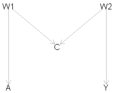
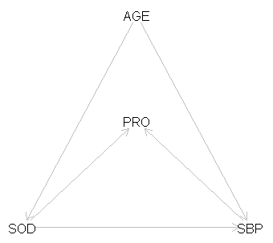
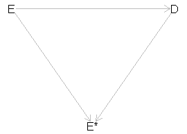

```{r xaringan-themer, include = FALSE}
library(xaringanthemer)
mono_light(
  base_color = "#1c5253",
  header_font_google = google_font("Josefin Sans"),
  # text_font_google   = google_font("M PLUS Rounded 1c", "300", "300i"),
  text_font_google = google_font("Noto Sans JP", "300", "300i"), 
  code_font_google   = google_font("Droid Mono"),
  text_bold_color = "#B03A2E",
  link_color = "#2c7fb8",
  title_slide_background_image = "pic/",
  inverse_text_shadow = TRUE
)
# write_xaringan_theme(text_bold_color = "#FF4333")
```


class: middle
# Objectives

- Introduction of using directed acyclic graphs (DAGs) to visualize the assumed structural relationships between variables. 

- Identify collider using DAG helps us avoid spurious (fake) associations and collider bias. 

???
Paradoxical associations between an outcome and exposure are common in epidemiological studies using observational data.

---

## Some Terminology


.pull-left[
<br><br>
```{r eval=FALSE}
library(dagitty)
g <- dagitty('dag {
    V6 [pos="2,0"]
    V4 [pos="1,-1"]
    V5 [pos="1,1"]
    V2 [pos="-1,-1"]
    V3 [pos="-1,1"]   
    V1 [pos="-2,0"]   

   V1 -> V4
   V1 -> V5 -> V6 
   V1 -> V3 -> V4 
   V2 -> V3 -> V4 
   V2 -> V5 -> V6
}')
plot(g)
```
]

.pull-right[
 <br>

- V2 is a **parent** of V5; 
- V5 is a **child** of V2;
- V6 is a **descendant** of V2 (and V5);
- V2 is an **ancestor** of V6 (and V5);
- V1 $\rightarrow$ V3 $\leftarrow$ V2 $\rightarrow$ V5 is a **path**;
- V4 is a **collider** on the path: <br> V1 $\rightarrow$ V4 $\leftarrow$ V3.   
]


---
class: middle, inverse

## An example of why DAG can help


---
class: middle

## Conditioning on a collider

- Suppose that V3 depends on both V1 and V2, while V1 and V2 are independent from each other:


```{r echo = FALSE, fig.align='center'}
knitr::include_graphics("img/collider.png")
```

- Then V1 and V2 will be **conditionally dependent (given V3)**, even though they are marginally independent. 


---
class: middle

## Reminder of what is a confounder

.pull-left[
- Confounding arises from **common causes** of the exposure (A) and the outcome (Y).


- The confounder (W) in the figure wholly/partially accounts for the observed association of the exposure (A) on the outcome (Y). 

- The presence of the confounder can lead to "confounding bias", and inaccurate estimates of the effects of A on Y.
]


.pull-right[

- This confounding bias will cause the crude odds ratio, different from the causal effect - conditional odds ratio. 

```{r echo = FALSE, fig.align='center'}
knitr::include_graphics("img/confounder.png")
```
]


---
class: middle

## Statistical structure of confounding

.pull-left[

- The path $A \leftarrow W \rightarrow Y$ is called a "back-door path".

- "back-door path": <br>any path from A to Y that **starts with an arrow into A**.

- Confounding can be removed by conditioning on variables on the "back-door path" <br> - **block the back-door path (via regression or stratification)**
]


.pull-right[

- To sufficiently **control for confounding**, we must identify a set of variables in the DAG that **block all open back-door paths** from the exposure (A) to the outcome (Y).

```{r echo = FALSE, fig.align='center'}
knitr::include_graphics("img/confounder.png")
```

]

---
class: middle

### Confounding effect and regression adjustment (simulation demonstration)

```{r}
N <-  1000 # sample size
set.seed(777)

W <- rnorm(N)                      # confounder
A <- 0.5 * W + rnorm(N)            # exposure
Y <- 0.3 * A + 0.4 * W + rnorm(N)  # outcome

fit1 <- lm(Y ~ A)                  # crude model
fit2 <- lm(Y ~ A + W)              # adjusted model 

```


???
- the confounder W is generated as a standard normal random variable with mean 0 and variance 1.

- The generation of A depends on the value of W plus an error term.

- Y is generated depending on both A and W plus an error term. 

- both error terms follow independent standard normal distribution. 

- this simulation assumes linear relationships between the variables. 

- And the true causal effect of A on Y is 0.3.


---
class: middle 

## Results from the crude and adjusted models (confounder effect)

```{r}
library(epiDisplay)
regress.display(fit1) ## crude coefficient
regress.display(fit2) ## adjusted coefficient
```
 

---
class: middle, inverse

## What if we condition on a collider?


---
class: middle 
## Statistical structure of a collider (1)

.pull-left[

```{r echo = FALSE, fig.align='center'}
knitr::include_graphics("img/collider_ije.png")
```

- imaging that rain (A) and a sprinkler (Y) are two reasons of a wet ground (C).

- If the ground is wet, and it is not raining, then the sprinkler must be on. 


]

.pull-right[

- Now the arrows are **towards C from A and Y**

- If we condition on C (using regression or stratification), we will create **collider bias**. 

- If we ignore the colliding structure, we may conclude that *rain has a negative effect on the sprinkler* even we know that this is not true. 
]

???
assume that the sprinkler is on a daily timer, and not related to the weather. 


---
class: middle 
## Statistical structure of a collider (2)

- Conditioning on a collider will introduce an association between Y and A (opens the back-door paths) even if they were unrelated. 

```{r}
N <- 1000   # sample size
set.seed(777)

A <- rnorm(N)                # exposure
Y <- 0.3 * A + rnorm(N)      # outcome
C <- 1.2 * A + 0.9 * Y + rnorm(N) # collider

fit3 <- lm(Y ~ A)            # crude model
fit4 <- lm(Y ~ A + C)        # adjusted model

```

???
- A was simulated as a standard normally distributed variable. 
- Y equals the value of A plus an error term.
- C is generated depending on both A and Y plus error. 
- the true causal effect of A on Y is 0.3

---
class: middle 

## Results from the crude and adjusted models (collider effect)

```{r}
regress.display(fit3) ## crude coefficient
regress.display(fit4) ## adjusted coefficient
```
 
???
- unlike adjusting for confounders, now the crude coefficient is the true causal effect between A and Y. 

- whereas the regression adjusting for collider is substantially biased. 


---
class: middle 

## What did we learn?

- If we ignore the collider structure of the variables, and just focus on the model predictive performance. Someone might erroneously choose the model controls the collider and report the **completely wrong (the opposite direction) association between A and Y**.

- Conditioning on the collider creates a paradox/collider bias. 

- DAG can help us understand the biological mechanisms in clinical epidemiological settings - **choose the correct confounders**.


---
class: middle

## Why is it important?

- The following graph shows another, more complex collider structure usually known as M-bias.  


```{r echo = FALSE, fig.align='center'}

```

- The collider (C) is the effect of a common cause (W1) of the exposure (A) and common cause (W2) of the outcome (Y). 

- There is only one back-door path, and it is already blocked by the collider (C) -- thus we do not need to adjust for anything.

- But some could consider C to be a classical confounder as it is associated with both exposure A (via $A \leftarrow W \rightarrow C$), and with the outcome Y (via $C \leftarrow W2 \rightarrow Y$) and is not in the causal pathway between A and Y.


---
class:middle

## Motivating example

- Evidence shows that exceeding the recommendations for 24h dietary sodium intake is associated with increased levels of systolic blood pressure (SBP).

- With advancing age, the kidney function declines. 

- Likewise, age is associated with changes in the blood pressures (SBP).

- Therefore, age is a common cause of both high SBP and impaired sodium homeostasis. <br>- **Age is a confounder** for assocation between sodium intake (SOD) and SBP

- However, high levels of 24-h excretion of urinary protein (PRO) are caused by high SBP and increased sodium intake (SOD). <br> - **PRO is a collider** between SOD and SBP.


---
class:middle 
## DAG for the relationship of the exposure, outcome, confounder and collider

```{r echo = FALSE, fig.align='center'}

```

We are interested in estimating the effect of sodium intake (SOD) on SBP.


---
class:middle 
## Data generation (simulation demo)


```{r}
generateData <- function(n, seed){
  set.seed(seed)
  Age_years <- rnorm(n, 65, 5)
  Sodium <- Age_years/18 + rnorm(n)
  sbp <- 1.05 * Sodium + 2.00 * Age_years + rnorm(n)
  hypertension <- ifelse(sbp > 140, 1, 0)
  PRO <- 2.00 * sbp + 2.80 * Sodium + rnorm(n)
  data.frame(sbp, hypertension, Sodium, Age_years, PRO)
}

ObsData <- generateData(n = 1000, seed = 777)

head(ObsData)
```


???
- The simulation assumes linear relationships between the variables; 
- The true causal effect of sodium intake on SBP is 1.05; 
- The coefficients for the association of PRO with SBP ad sodium intake are 2.0, and 2.8


---
class: middle

## Linear regressions using the `ObsData`

- Model 0: $\text{SBP} = \beta_0 + \beta_1\text{SOD} + \varepsilon$ ;

- Model 1: $\text{SBP} = \beta_0 + \beta_1\text{SOD} + \beta_2 \text{Age} + \varepsilon$ ;

- Model 2: $\text{SBP} = \beta_0 + \beta_1\text{SOD} + \beta_2 \text{Age} + \beta_3\text{PRO} + \varepsilon$

```{r}
# Model fit
fit0 <- lm(sbp ~ Sodium, data = ObsData)
fit1 <- lm(sbp ~ Sodium + Age_years, data = ObsData)
fit2 <- lm(sbp ~ Sodium + Age_years + PRO, data = ObsData)
```

???
- We fit three different linear regression models 
- to evaluate the effect of sodium intake on SBP
- Model 0 is the unadjusted model 
- Model 1 adjusted for age only 
- Model 2 adjusted for age and the collider (PRO).


---
class: middle
### Results from the crude, and age-adjusted models for the association between SOD and SBP

```{r}
regress.display(fit0, decimal = 3)
regress.display(fit1, decimal = 3)
```

???

- The crude model showed biased association between sodium intake and SBP caused by confounding effect from age. 

- The age-adjusted model showed the causal effect that is close to the true effect. 

---
class: middle 
### Results from the age and PRO(collider)-adjusted models for the association between SOD and SBP

```{r}
regress.display(fit2, decimal = 3)
```

???

- The collider model suggested a negative relationship between sodium intake and SBP.
- -0.902 suggested that for one unit increase in sodium take, the expected SBP **decrease** by 0.9 mmHg.
- This is not only wrong, it is completely wrong. 


---
class: middle, inverse, center 
## How about conditioning colliders in a logistic regression model?

---
class: middle

### Logistic regression model1 -- crude model:


```{r}
fit3 <- glm(hypertension ~ Sodium, family = binomial(link = "logit"), data = ObsData)
# logistic.display(fit3, decimal = 3)
library(broom)
tidy(fit3, exponentiate =  TRUE, conf.int = TRUE)%>% 
   mutate_if(is.numeric, round, digits = 4)
```

---
class: middle 

### Logistic regression model2 -- age adjusted:


```{r warning=FALSE}
fit4 <- glm(hypertension ~ Sodium + Age_years, family = binomial(link = "logit"), data = ObsData)
# logistic.display(fit4, decimal = 3)
tidy(fit4, exponentiate =  TRUE, conf.int = TRUE) %>% 
   mutate_if(is.numeric, round, digits = 4)
```

???

- Age adjusted OR for one-unit increase of Sodium intake on being hypertensive was 7.94. 


---
class: middle 

### Logistic regression model3 -- collider adjusted:


```{r warning=FALSE}
fit5 <- glm(hypertension ~ Sodium + Age_years + PRO, family = binomial(link = "logit"), data = ObsData)
# logistic.display(fit5, decimal = 3)
tidy(fit5, exponentiate =  TRUE, conf.int = TRUE)%>% 
   mutate_if(is.numeric, round, digits =4)
```

???
- Collider adjusted model gave protective effect again. 

- And one unit increase in sodium intake would decrease the risk of hypertension by 98%!!!
 

---
class: middle 

### Logistic regression models -- odds ratios:


```{r echo=FALSE, fig.align='center', fig.height=7, fig.width=11, message=FALSE, warning=FALSE}
library(dplyr)
library(forestplot)

or <- round(exp(fit3$coefficients[2]), 3)
ci95 <- exp(confint(fit3))[-1, ]

lci <- round(ci95[1],3)
uci <- round(ci95[2],3)
model <- c("Crude")
result1 <- data.frame(model, or, lci, uci, stringsAsFactors = FALSE)

or <- round(exp(fit4$coef)[2],3)
ci95 <- exp(confint(fit4))[2,]
lci <- round(ci95[1],3)
uci <- round(ci95[2],3)
model <- c("Adjusted")
result2 <- data.frame(model, or, lci, uci, stringsAsFactors = FALSE)


or <- round(exp(fit5$coef)[2],3)
ci95 <- exp(confint(fit5))[2,]
lci <- round(ci95[1],3)
uci <- round(ci95[2],3)
model <- c("Collider")
result3 <- data.frame(model, or, lci, uci, stringsAsFactors = FALSE)


# Models fit visualization (Forest plot function and plot) to depict the collider effect
or_graph <- function(fp){
    
    tabla <- cbind(c("Model", paste(fp$model)),
                   c("Odds ratio", fp$or), 
                   c("95%CI", paste0("(", fp$lci, " - ", fp$uci, ")")))

    forestplot(labeltext = tabla,
               graph.pos = 3,
               mean = c(NA, fp$or),
               is.summary = c(TRUE, rep(FALSE, nrow(fp))),
               lower = c(NA, fp$lci),
               upper = c(NA, fp$uci),
               xlab = "Odds ratio",
               txt_gp = fpTxtGp(label = gpar(cex = 1.25),
                                ticks = gpar(cex = 1.1),
                                xlab  = gpar(cex = 1.2),
                                title = gpar(cex = 1.2)),
               col = fpColors(box = "royalblue", lines = "royalblue", zero = "black"),
               cex = 1.5,
               clip = c(0, 10),
               zero = 1,
               boxsize = 0.05,
               lwd.ci = 2,
               ci.vertices = TRUE,
               lineheight = "auto",
               xticks = seq(0, 10, 1),
               ci.vertices.height = 0.1,
               grid = TRUE
    )
}

fp <- rbind(result1, result2, result3); fp %>% or_graph()

```


One unit increase in SOD intake would **decrease the risk of hypertension by 98%!!!**


---
class: middle 

## What did we learn?


- The decision whether to include or exclude the variable in a regression model is based on whether the purpose of the study is prediction or explanation/causation. 

- Adding a collider to a regression model is **not advised when we are intereted in estimation of causal effects**, because this will open back-door path. 

- However, if prediction is the purpose of the model, inclusion of colliders may be advisable if it can reduce the model's prediction error. 

- Most epidemiological researches are trying to understand/explain **how the world works (causation)**. We should be aware of such kind of collider bias. 


---
class: middle 

# Exercise -- (1)

A case-control study is conducted in order to address whether exposure to a particular non-steroidal anti-inflammatory drug during the first trimester of pregancy causes a congenital defect $(D)$ arising in the second trimester:

- $D = 1$ for cases, $D = 0$ for controls;

- $E^*$ denotes the use of the drug during the first trimester as **self-reported 1 month postpartum**;

- $E$ denotes the use of the drug during the first trimester as **recorded in accurate medical records**.


Draw an appropriate causal diagram for this problem, involving $D$, $E$ and $E^*$


---
class: middle 

# Exercise -- (1)

Here are the results of various analyses exploring (crude and adjusted) associations between $E$, $E^*$, and $D$:


- Crude OR (odds ratio) for association between $E$ and $D$: $1.73$; 

- OR for association between $E$ and $D$, adjusted for $E^*$: $1.06$; 

- Crude OR (odds ratio) for association between $E^*$ and $D$: $2.00$;

- OR for association between $E^*$ and $D$, adjusted for $E$: $1.52$.

**What is the most appropriate analysis to answer the question of interest?**

---
class: middle 

# Exercise -- (1)

.pull-left[- The case-control study setting with recall bias:

```{r echo = FALSE, fig.align='center'}

```

- The causal effect of interest is from $E$ to $D$;

- The exposure reported by the mother $E^*$ might be affected by the true exposure as well as the disease outcome.
]

.pull-right[

- The arrow from $D$ to $E^*$ represents **the recall bias**;

- Because conditional on $E$, there is an association between $E^*$ and $D$ (OR = 1.52), therefore, **recall bias is present**.

- If there is no recall bias, ie. no arrow from $D$ to $E^*$, conditioning on E will give us a conditional odds ratio of 1 $\neq$ 1.52. 


- Conditioning on $E^*$ changes the estimate of association between $E$ and $D$ to null (1.06 $\approx$ 1.00) <br> $\Rightarrow$ $E^*$ is the collider. 

]


---
class: middle 

## The DAG web application 

[http://www.dagitty.net/dags.html](http://www.dagitty.net/dags.html)


Johannes Textor, Benito van der Zander, Mark K. Gilthorpe, Maciej Liskiewicz, George T.H. Ellison. 
Robust causal inference using directed acyclic graphs: the R package 'dagitty'.
International Journal of Epidemiology 45(6):1887-1894, 2016.


---
class: middle

## Thanks to the following paper

Luque-Fernandez, M. A. et al. Educational Note: Paradoxical collider effect in the analysis of non-communicable disease epidemiological data: a reproducible illustration and web application. International Journal of Epidemiology 48, 640–653 (2019).


---
class: middle, center 

# The end

## slide address: https://wangcc.me/DAG-CSS