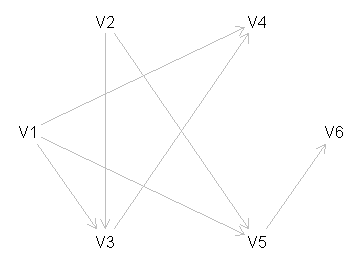
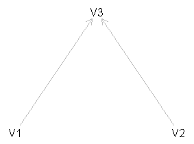
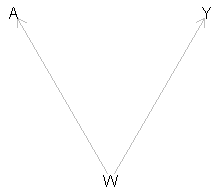
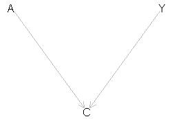
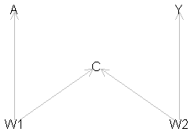

```{r xaringan-themer, include = FALSE}
library(xaringanthemer)
mono_light(
  base_color = "#1c5253",
  header_font_google = google_font("Josefin Sans"),
  # text_font_google   = google_font("M PLUS Rounded 1c", "300", "300i"),
  text_font_google = google_font("Noto Sans JP", "300", "300i"), 
  code_font_google   = google_font("Droid Mono"),
  text_bold_color = "#B03A2E",
  link_color = "#2c7fb8",
  title_slide_background_image = "pic/",
  inverse_text_shadow = TRUE
)
# write_xaringan_theme(text_bold_color = "#FF4333")
```


class: middle
# Objectives

- Introduce DAGs and how they can be used to find **conditional independences** from simpler assumptions.

- Discuss how DAGs are used in causal inference


---

## Some Terminology


.pull-left[
<br><br>
```{r eval=FALSE}
library(dagitty)
g <- dagitty('dag {
    V6 [pos="2,0"]
    V4 [pos="1,-1"]
    V5 [pos="1,1"]
    V2 [pos="-1,-1"]
    V3 [pos="-1,1"]   
    V1 [pos="-2,0"]   

   V1 -> V4
   V1 -> V5 -> V6 
   V1 -> V3 -> V4 
   V2 -> V3 -> V4 
   V2 -> V5 -> V6
}')
plot(g)
```
]

.pull-right[
 <br>

- V2 is a **parent** of V5; 
- V5 is a **child** of V2;
- V6 is a **descendant** of V2 (and V5);
- V2 is an **ancestor** of V6 (and V5);
- V1 $\rightarrow$ V3 $\leftarrow$ V2 $\rightarrow$ V5 is a **path**;
- V4 is a **collider** on the path: <br> V1 $\rightarrow$ V4 $\leftarrow$ V3.   
]


---
class: middle, inverse

## An example of why DAG can help


---
class: middle

## Conditioning on a collider

- Suppose that V3 depends on both V1 and V2, while V1 and V2 are independent from each other:


```{r echo = FALSE, fig.align='center'}

```

- Then V1 and V2 will be **conditionally dependent (given V3)**, even though they are marginally independent. 


---
class: middle

## Reminder of what is a confounder

.pull-left[
- Confounding arises from **common causes** of the exposure (A) and the outcome (Y).


- The confounder (W) in the figure wholly/partially accounts for the observed association of the exposure (A) on the outcome (Y). 

- The presence of the confounder can lead to "confounding bias", and inaccurate estimates of the effects of A on Y.
]


.pull-right[

- This confounding bias will cause the crude odds ratio, different from the causal effect - conditional odds ratio. 

```{r echo = FALSE, fig.align='center'}

```
]


---
class: middle

## Statistical structure of confounding

.pull-left[

- The path $A \leftarrow W \rightarrow Y$ is called a "back-door path".

- "back-door path": <br>any path from A to Y that **starts with an arrow into A**.

- Confounding can be removed by conditioning on variables on the "back-door path" <br> - **block the back-door path (via regression or stratification)**
]


.pull-right[

- To sufficiently **control for confounding**, we mush identify a set of variables in the DAG that **block all open back-door paths** from the exposure (A) to the outcome (Y).

```{r echo = FALSE, fig.align='center'}

```

]

---
class: middle

## Confounding effect and regression adjustment

```{r}
N <-  1000 # sample size
set.seed(777)

W <- rnorm(N)                      # confounder
A <- 0.5 * W + rnorm(N)            # exposure
Y <- 0.3 * A + 0.4 * W + rnorm(N)  # outcome

fit1 <- lm(Y ~ A)                  # crude model
fit2 <- lm(Y ~ A + W)              # adjusted model 

```


???
- the confounder W is generated as a standard normal random variable with mean 0 and variance 1.

- The generation of A depends on the value of W plus an error term.

- Y is generated depending on both A and W plus an error term. 

- both error terms follow independent standard normal distribution. 

- this simulation assumes linear relationships between the variables. 

- And the true causal effect of A on Y is 0.3.


---
class: middle 

## Results from the crude and adjusted models (confounder effect)

```{r}
library(epiDisplay)
regress.display(fit1) ## crude coefficient
regress.display(fit2) ## adjusted coefficient
```
 

---
class: middle, inverse

## What if we condition on a collider?


---
class: middle 
## Statistical structure of a collider (1)

.pull-left[

```{r echo = FALSE, fig.align='center'}

```

- imaging that rain (A) and a sprinkler (Y) are two reasons of a wet ground (C).

- If the ground is wet, and it is not raining, then the sprinkler must be on. 


]

.pull-right[

- Now the arrows are **towards C from A and Y**

- If we condition on C (using regression or stratification), we will create **collider bias**. 

- If we ignore the colliding structure, we may conclude that *rain has a negative effect on the sprinkler* even we know that this is not true. 
]

???
assume that the sprinkler is on a daily timer, and not related to the weather. 


---
class: middle 
## Statistical structure of a collider (2)

- Conditioning on a collider will introduce an association between Y and A (opens the back-door paths) even if they were unrelated. 

```{r}
N <- 1000   # sample size
set.seed(777)

A <- rnorm(N)                # exposure
Y <- 0.3 * A + rnorm(N)      # outcome
C <- 1.2 * A + 0.9 * Y + rnorm(N) # collider

fit3 <- lm(Y ~ A)            # crude model
fit4 <- lm(Y ~ A + C)        # adjusted model

```

???
- A was simulated as a standard normally distributed variable. 
- Y equals the value of A plus an error term.
- C is generated depending on both A and Y plus error. 
- the true causal effect of A on Y is 0.3

---
class: middle 

## Results from the crude and adjusted models (collider effect)

```{r}
library(epiDisplay)
regress.display(fit3) ## crude coefficient
regress.display(fit4) ## adjusted coefficient
```
 
???
- unlike adjusting for confounders, now the crude coefficient is the true causal effect between A and Y. 

- whereas the regression adjusting for collider is substantially biased. 


---
class: middle 

## What did we learn?

- If we ignore the collider structure of the variables, and just focus on the model predictive performance. Someone might erroneously choose the model controls the collider and report the **completely wrong (the opposite direction) association between A and Y**.

- Conditioning on the collider creates a paradox/collider bias. 

- DAG can help us understand the biological mechanisms in clinical epidemiological settings - **choose the correct confounders**.


---
class: middle

## Why is it important?

- The following graph shows another, more complex collider structure usually known as M-bias.  


```{r echo = FALSE, fig.align='center'}

```

- The collider (C) is the effect of a common cause (W1) of the exposure (A) and common cause (W2) of the outcome (Y). 

- There is only one back-door path, and it is already blocked by the collider (C) -- thus we do not need to adjust for anything.

- But some could consider C to be a classical confounder as it is associated with both exposure A (via $A \leftarrow W \rightarrow C$), and with the outcome Y (via $C \leftarrow W2 \rightarrow Y$) and is not in the causal pathway between A and Y.